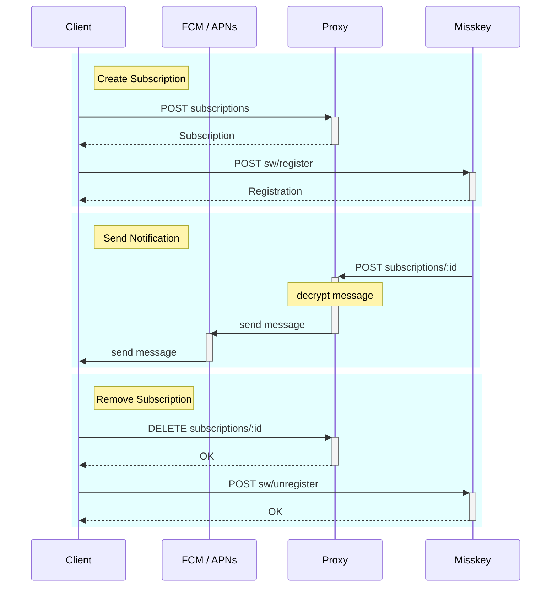

# Misskey Web Push Proxy

Decrypt Web Push notifications received from Misskey servers and forward them
via Firebase Cloud Messaging or Apple Push Notification service.

## Setup

### Using FCM

1. Create and set up your Firebase project.
2. Obtain a private key from Firebase Console.
   1. Open "Project settings" -> "Service Accounts".
   2. Click "Generate new private key".
3. Set the following environment variables with the corresponding values in the
   generated JSON file.
   - `FIREBASE_PROJECT_ID`: `private_key_id`
   - `FIREBASE_PRIVATE_KEY`: `private_key`
   - `FIREBASE_CLIENT_EMAIL`: `client_email`

### Using APNs

1. Obtain a key from Apple Developer.
   - See [Establishing a token-based connection to APNs].
2. Set the following environment variables.
   - `APPLE_BUNDLE_ID`: Bundle Identifier of your app
   - `APPLE_ENCRYPTION_KEY`: Contents of the generated key file
   - `APPLE_ENCRYPTION_KEY_ID`: Key ID of the key
   - `APPLE_TEAM_ID`: Your Team ID

[Establishing a token-based connection to APNs]: https://developer.apple.com/documentation/usernotifications/establishing-a-token-based-connection-to-apns#Obtain-an-encryption-key-and-key-ID-from-Apple

### Settings for Cloudflare Workers

1. Install Denoflare
   - ```sh
     deno install --global --allow-import=cdn.skypack.dev:443,deno.land:443,jsr.io:443,raw.githubusercontent.com:443 --allow-write --unstable-worker-options --allow-read --allow-net --allow-env --allow-run --name denoflare --force \
     https://raw.githubusercontent.com/skymethod/denoflare/0087ded3efefe068711b60fb2480e3e8386ce172/cli/cli.ts
     ```
2. Create a KV namespace.
3. Create a D1 database.
   - Create a table by running the following command:
     ```sql
     CREATE TABLE subscriptions (
         id TEXT PRIMARY KEY ON CONFLICT REPLACE,
         fcmToken TEXT DEFAULT NULL,
         apnsToken TEXT DEFAULT NULL,
         auth TEXT NOT NULL,
         publicKey TEXT NOT NULL,
         privateKey TEXT NOT NULL,
         vapidKey TEXT NOT NULL
     )
     ```
4. Rename `.denoflare.example` to `.denoflare` and fill in the values.
5. Run `denoflare push misskey-web-push-proxy --compatibility-date 2024-11-11`.

## Sequence diagram


